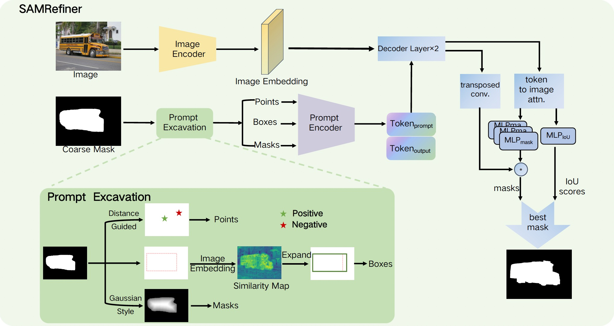

# SAMRefiner: Taming Segment Anything Model for Universal Mask Refinement (ICLR 2025)
:closed_book: [[Paper]](https://arxiv.org/abs/)




## Installation

Our code is based on [official SAM](https://github.com/facebookresearch/segment-anything), requiring `python>=3.8`, as well as `pytorch>=1.7` and `torchvision>=0.8`. Please follow the instructions [here](https://pytorch.org/get-started/locally/) to install both PyTorch and TorchVision dependencies. For example:


```
# create conda env
conda create -n SAMRefiner python=3.8
conda activate SAMRefiner

# install packages
pip install torch==1.11.0+cu113 torchvision==0.12.0+cu113 --extra-index-url https://download.pytorch.org/whl/cu113
pip install opencv-python tqdm matplotlib scipy
pip install FastGeodis --no-build-isolation --no-cache-dir
cd segment-anything; pip install -e .; cd ..

```


## Usage
### SAM

First download a [model checkpoint](https://github.com/facebookresearch/segment-anything?tab=readme-ov-file#model-checkpoints) to <path/to/checkpoint>. For example, download the default sam_vit_h:
```
wget https://dl.fbaipublicfiles.com/segment_anything/sam_vit_h_4b8939.pth -O <path/to/checkpoint>
```

Then the model can be used in just a few lines to refine the given initial coarse mask (binary, 0-1 valued):

```
from segment_anything import sam_model_registry
from sam_refiner import sam_refiner
import numpy as np
from PIL import Image

model_type = "sam-vit_h"
sam_checkpoint = <path/to/checkpoint>
device = "cuda"
sam = sam_model_registry[model_type](checkpoint=sam_checkpoint)
sam.to(device=device)

image_path = 'examples/2007_000256.jpg'
mask_path = 'examples/2007_000256_init_mask.png'
init_masks = np.asarray(Image.open(mask_path), dtype=np.uint8)

if np.max(init_masks) == 255:
    init_masks = init_masks / 255

refined_masks = sam_refiner(image_path, 
            [init_masks],
            sam)[0]
                            
print(refined_masks.shape)

Image.fromarray(255*refined_masks[0].astype(np.uint8)).save('examples/2007_000256_refined_mask.png')
```

### HQ-SAM
If you want to use the advanced HQ-SAM, first install sam-hq and download their [model checkpoints](https://github.com/SysCV/sam-hq/tree/main?tab=readme-ov-file#model-checkpoints) manually. For example:
```
## install
cd sam-hq; pip install -e .
cd ..
pip install timm==0.6.13

## manually download sam_hq_vit_h.pth to <path/to/checkpoint>
```

Then, the refinement process is similar to SAM by specifying checkpoint path and setting `use_samhq=True`:
```
from segment_anything import sam_model_registry
from sam_refiner import sam_refiner
import numpy as np
from PIL import Image

model_type = "sam-vit_h"
sam_checkpoint = <path/to/checkpoint>
device = "cuda"
sam = sam_model_registry[model_type](checkpoint=sam_checkpoint)
sam.to(device=device)

image_path = 'examples/2007_000256.jpg'
mask_path = 'examples/2007_000256_init_mask.png'
init_masks = np.asarray(Image.open(mask_path), dtype=np.uint8)

if np.max(init_masks) == 255:
    init_masks = init_masks / 255

refined_masks = sam_refiner(image_path, 
            [init_masks],
            sam,
            use_samhq=True)[0]
                            
print(refined_masks.shape)

Image.fromarray(255*refined_masks[0].astype(np.uint8)).save('examples/2007_000256_refined_mask_samhq.png')
```

More details about the parameters used for customized prompts can be found in sam_refiner.py  


## Acknowledgement
We borrowed the code from [segment-anything](https://github.com/facebookresearch/segment-anything) and [HQ-SAM](https://github.com/SysCV/sam-hq). Thanks for their wonderful works.

## Citation
If you find this project helpful for your research, please consider citing our work.